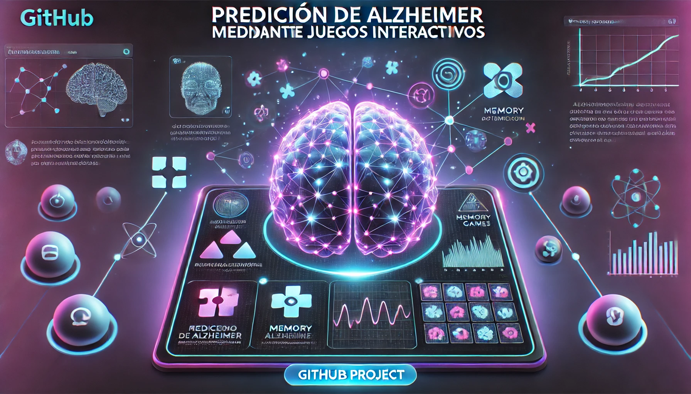
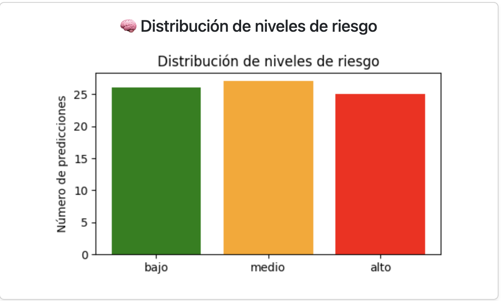
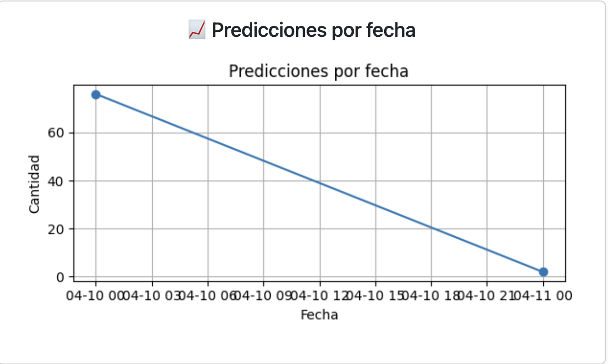
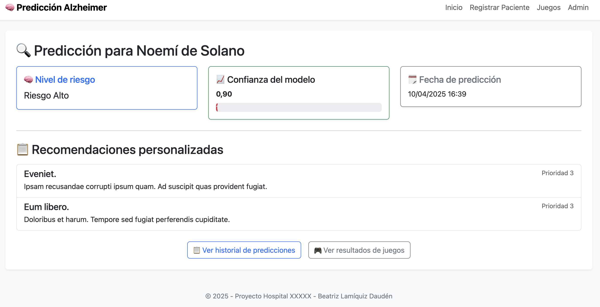
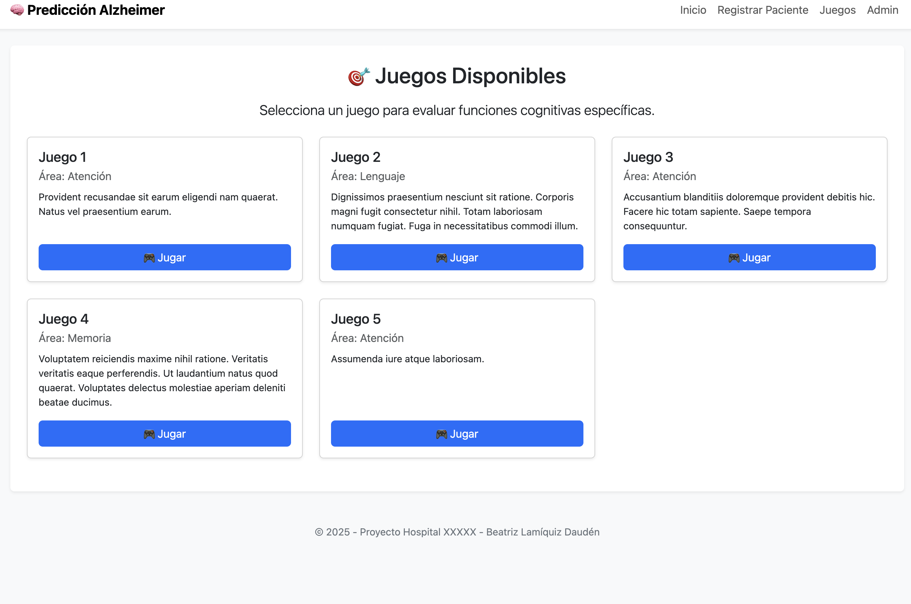
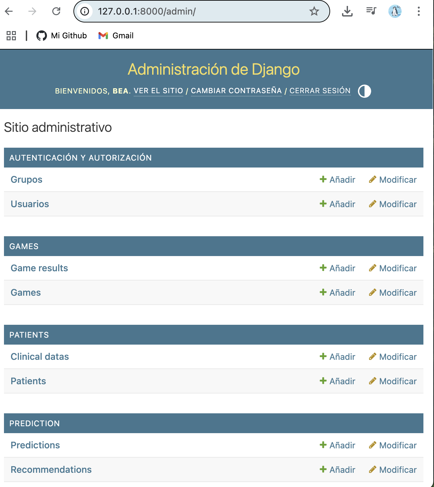

# 🧠 Predicción de Alzheimer mediante Juegos Interactivos

Aplicación web desarrollada con **Django** orientada a la **detección temprana del riesgo de Alzheimer** mediante juegos cognitivos interactivos.  
El sistema recoge métricas de rendimiento cognitivo, genera **predicciones automáticas** con Machine Learning y ofrece **recomendaciones personalizadas** orientadas al seguimiento y la prevención.

> ⚠️ **Proyecto educativo y de investigación. No constituye un diagnóstico clínico.**

---

## 🎯 Objetivo del proyecto

Explorar cómo la **gamificación cognitiva**, combinada con **análisis de datos y modelos predictivos**, puede servir como herramienta de apoyo para:
- Identificar patrones de riesgo
- Facilitar el seguimiento cognitivo
- Traducir datos complejos en información comprensible para profesionales y usuarios

---

## 🚀 Funcionalidades principales

- Registro y gestión de pacientes
- Juegos cognitivos clasificados por áreas (memoria, atención, velocidad de procesamiento…)
- Registro detallado de resultados:
  - Puntuación
  - Errores
  - Tiempo de ejecución
- Generación automática de predicciones de riesgo
- Recomendaciones personalizadas según el resultado
- Dashboard interactivo con métricas clave
- Filtros dinámicos con AJAX
- Exportación de datos a CSV
- Panel de administración completo con Django Admin

---

## 📊 Dashboard de análisis

El dashboard centraliza la información relevante para el seguimiento:

- Total de predicciones realizadas
- Última predicción registrada
- Último paciente incorporado

### Distribución de niveles de riesgo


### Evolución de predicciones en el tiempo


### Filtros dinámicos y exportación


---

## 🧾 Detalle de una predicción

Cada predicción muestra:
- Nivel de riesgo estimado
- Variables analizadas
- Recomendaciones automáticas personalizadas



---

## 🎮 Juegos cognitivos

Los juegos están diseñados para evaluar distintas capacidades cognitivas y generar datos estructurados para el modelo predictivo.



---

## ⚙️ Administración con Django

Gestión completa de pacientes, juegos, resultados y predicciones desde el panel de administración.



---

## 🧠 Modelo de predicción

El sistema utiliza un modelo de **Random Forest**, entrenado para clasificar el nivel de riesgo en tres categorías:

- `bajo`
- `medio`
- `alto`

### Variables de entrada
- Puntuación del juego (`score`)
- Número de errores (`errores`)
- Tiempo empleado (`tiempo`)

### Salida
- Nivel de riesgo cognitivo estimado

### Tecnologías del modelo
- `scikit-learn`
- `LabelEncoder`
- Persistencia con `joblib`

```python
model = RandomForestClassifier(n_estimators=100, random_state=42)
model.fit(X_train, y_train)

