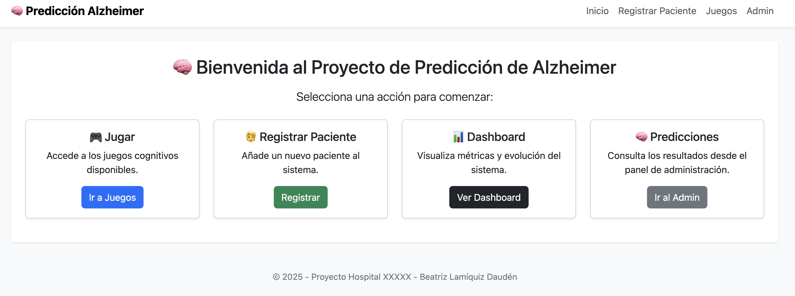

# 🧠 Predicción de Alzheimer mediante Juegos Interactivos

Este proyecto es una aplicación web construida con Django que permite predecir el nivel de riesgo de Alzheimer en pacientes, utilizando resultados de juegos cognitivos interactivos. Además, genera recomendaciones automáticas personalizadas basadas en el resultado de cada predicción.



---

## 🚀 Funcionalidades

- Registro y gestión de pacientes
- Juegos clasificados por áreas cognitivas (memoria, atención, etc.)
- Registro de resultados por juego (puntuación, errores, tiempo)
- Generación de predicciones automáticas con modelo de Machine Learning
- Visualización de gráficas interactivas en el dashboard
- Exportación a CSV de predicciones y resultados
- Sistema AJAX para filtros en tiempo real
- Panel de administración completo y visual

---

## 📊 Dashboard

El sistema cuenta con un dashboard que incluye:

- Total de predicciones realizadas
- Última predicción y último paciente registrado

### Distribución de niveles de riesgo


### Evolución de predicciones por fecha


### Filtros por paciente y exportación a CSV


---

## 🧾 Detalle de una predicción


---

## 🎮 Juegos cognitivos


---

## ⚙️ Administración desde Django


---

## 🧠 Cómo funciona el modelo de predicción

El sistema utiliza un modelo de tipo **Random Forest**, una técnica basada en árboles de decisión combinados para mejorar la precisión y evitar el sobreajuste.

📥 Entradas:
- Puntuación del juego (`score`)
- Errores cometidos (`errores`)
- Tiempo empleado (`tiempo`)

📤 Salida:
- Nivel de riesgo: `bajo`, `medio` o `alto`

El modelo está entrenado con `scikit-learn`, codificado con `LabelEncoder` y guardado en formato `.pkl` con `joblib`.

```python
model = RandomForestClassifier(n_estimators=100, random_state=42)
model.fit(X_train, y_train)
✅ Tras cada juego, se realiza una predicción con estos datos y se genera automáticamente una recomendación personalizada para el paciente.

💡 Recomendaciones automáticas
El sistema genera automáticamente sugerencias en función del nivel de riesgo:

🧠 Actividades cognitivas

🥦 Estilo de vida saludable

📅 Seguimiento médico

🛠️ Tecnologías utilizadas
Python 3.13

Django 4+

SQLite (fácil de migrar a PostgreSQL)

scikit-learn + joblib (modelo predictivo)

Matplotlib (gráficos embebidos)

Faker (datos de prueba)

Bootstrap 5 + AJAX (interfaz moderna)

🧪 Instalación
bash
Copiar código
# Clonar el repositorio
git clone https://github.com/beatrizlamiquiz/prediccion-alzheimer.git
cd prediccion-alzheimer

# Crear y activar entorno virtual
python3 -m venv venv
source venv/bin/activate

# Instalar dependencias
pip install -r requirements.txt

# Migrar la base de datos
python manage.py migrate

# Crear superusuario
python manage.py createsuperuser

# Ejecutar servidor
python manage.py runserver
🔒 Aviso legal
Esta aplicación es solo con fines educativos y de investigación.
No reemplaza diagnóstico clínico ni asesoramiento médico.
Se prohíbe su uso con fines terapéuticos sin validación científica adecuada.

👩‍💻 Autora
Desarrollado por Beatriz Lamiquiz